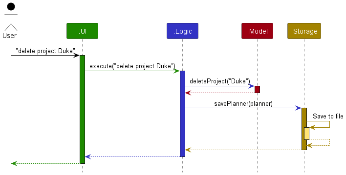
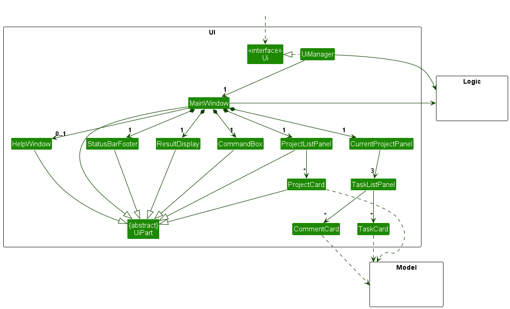
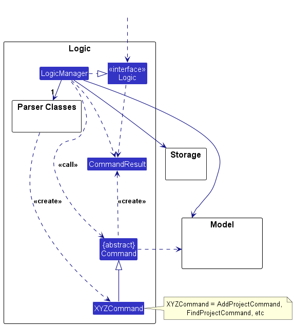
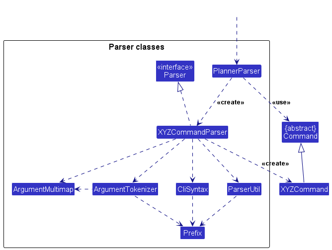
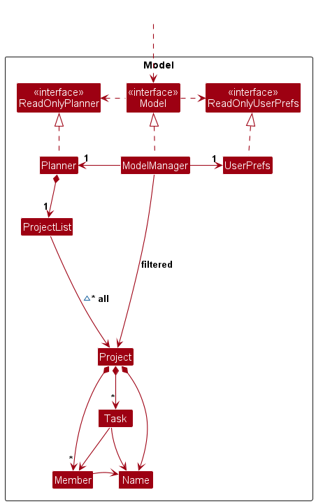
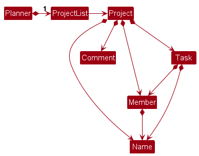
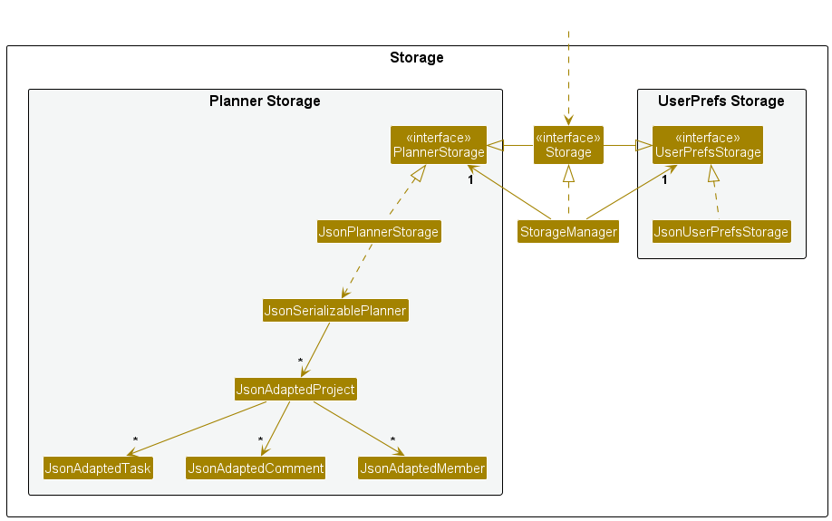

- Table of Contents
  {:toc}

---

## **Acknowledgements**

- This project is based on the AddressBook-Level3 project created by the [SE-EDU initiative](https://se-education.org/).

---

## **Setting up, getting started**

Refer to the guide [_Setting up and getting started_](SettingUp.md).

---

## **Design**

:bulb: **Tip:** The `.puml` files used to create diagrams in this document `docs/diagrams` folder. Refer to the [_PlantUML Tutorial_ at se-edu/guides](https://se-education.org/guides/tutorials/plantUml.html) to learn how to create and edit diagrams.

### Architecture

The **_Architecture Diagram_** given above explains the high-level design of the App.

Given below is a quick overview of main components and how they interact with each other.

**Main components of the architecture**

**`Main`** (consisting of classes [`Main`](https://github.com/se-edu/addressbook-level3/tree/master/src/main/java/seedu/address/Main.java) and [`MainApp`](https://github.com/se-edu/addressbook-level3/tree/master/src/main/java/seedu/address/MainApp.java)) is in charge of the app launch and shut down.

- At app launch, it initializes the other components in the correct sequence, and connects them up with each other.
- At shut down, it shuts down the other components and invokes cleanup methods where necessary.

The bulk of the app's work is done by the following four components:

- [**`UI`**](#ui-component): The UI of the App.
- [**`Logic`**](#logic-component): The command executor.
- [**`Model`**](#model-component): Holds the data of the App in memory.
- [**`Storage`**](#storage-component): Reads data from, and writes data to, the hard disk.

[**`Commons`**](#common-classes) represents a collection of classes used by multiple other components.

**How the architecture components interact with each other**

The _Sequence Diagram_ below shows how the components interact with each other for the scenario where the user issues the command `delete project Duke`.

Each of the four main components (also shown in the diagram above),

- defines its _API_ in an `interface` with the same name as the Component.
- implements its functionality using a concrete `{Component Name}Manager` class (which follows the corresponding API `interface` mentioned in the previous point.

For example, the `Logic` component defines its API in the `Logic.java` interface and implements its functionality using the `LogicManager.java` class which follows the `Logic` interface. Other components interact with a given component through its interface rather than the concrete class (reason: to prevent outside component's being coupled to the implementation of a component), as illustrated in the (partial) class diagram below.

The sections below give more details of each component.

### UI component

The **API** of this component is specified in [`Ui.java`](https://github.com/se-edu/addressbook-level3/tree/master/src/main/java/seedu/address/ui/Ui.java)

The UI consists of a `MainWindow` that is made up of parts e.g.`CommandBox`, `ResultDisplay`, `ProjectListPanel`, `StatusBarFooter`, `CurrentProjectPanel` etc. All these, including the `MainWindow`, inherit from the abstract `UiPart` class which captures the commonalities between classes that represent parts of the visible GUI.

The `UI` component uses the JavaFx UI framework. The layout of these UI parts are defined in matching `.fxml` files that are in the `src/main/resources/view` folder. For example, the layout of the [`MainWindow`](https://github.com/se-edu/addressbook-level3/tree/master/src/main/java/seedu/address/ui/MainWindow.java) is specified in [`MainWindow.fxml`](https://github.com/se-edu/addressbook-level3/tree/master/src/main/resources/view/MainWindow.fxml)

The `UI` component,

- executes user commands using the `Logic` component.
- listens for changes to `Model` data so that the UI can be updated with the modified data.
- keeps a reference to the `Logic` component, because the `UI` relies on the `Logic` to execute commands.
- depends on some classes in the `Model` component, as it displays `Project` object residing in the `Model`.

### Logic component

**API** : [`Logic.java`](https://github.com/se-edu/addressbook-level3/tree/master/src/main/java/seedu/address/logic/Logic.java)

Here's a (partial) class diagram of the `Logic` component:

The sequence diagram below illustrates the interactions within the `Logic` component, taking `execute("delete project Duke")` API call as an example.

:information_source: **Note:** The lifeline for `DeleteProjectCommandParser` should end at the destroy marker (X) but due to a limitation of PlantUML, the lifeline continues till the end of diagram.

How the `Logic` component works:

1. When `Logic` is called upon to execute a command, it is passed to an `PlannerParser` object which in turn creates a parser that matches the command (e.g., `DeleteProjectCommandParser`) and uses it to parse the command.
1. This results in a `Command` object (more precisely, an object of one of its subclasses e.g., `DeleteProjectCommand`) which is executed by the `LogicManager`.
1. The command can communicate with the `Model` when it is executed (e.g. to delete a project). 
   Note that although this is shown as a single step in the diagram above (for simplicity), in the code it can take several interactions (between the command object and the `Model`) to achieve.
1. The result of the command execution is encapsulated as a `CommandResult` object which is returned back from `Logic`.

Here are the other classes in `Logic` (omitted from the class diagram above) that are used for parsing a user command:

How the parsing works:

- When called upon to parse a user command, the `PlannerParser` class creates an `XYZCommandParser` (`XYZ` is a placeholder for the specific command name e.g., `AddProjectCommandParser`) which uses the other classes shown above to parse the user command and create a `XYZCommand` object (e.g., `AddProjectCommand`) which the `PlannerParser` returns back as a `Command` object.
- All `XYZCommandParser` classes (e.g., `AddProjectCommandParser`, `DeleteProjectCommandParser`, ...) inherit from the `Parser` interface so that they can be treated similarly where possible e.g, during testing.

### Model component

**API** : [`Model.java`](https://github.com/se-edu/addressbook-level3/tree/master/src/main/java/seedu/address/model/Model.java)

The `Model` component,

- stores the DevPlanPro data i.e., all `Project` objects (which are contained in a `ProjectList` object).
- stores the currently 'selected' `Project` objects (e.g., results of a search query) as a separate _filtered_ list which is exposed to outsiders as an unmodifiable `ObservableList<Project>` that can be 'observed' e.g. the UI can be bound to this list so that the UI automatically updates when the data in the list change.
- stores a `UserPref` object that represents the user’s preferences. This is exposed to the outside as a `ReadOnlyUserPref` objects.
- does not depend on any of the other three components (as the `Model` represents data entities of the domain, they should make sense on their own without depending on other components)

:information_source: **Note:** An alternative (arguably, a more OOP) model is given below. 

### Storage component

**API** : [`Storage.java`](https://github.com/se-edu/addressbook-level3/tree/master/src/main/java/seedu/address/storage/Storage.java)

The `Storage` component,

- can save both DevPlanPro data and user preference data in JSON format, and read them back into corresponding objects.
- inherits from both `PlannerStorage` and `UserPrefStorage`, which means it can be treated as either one (if only the functionality of only one is needed).
- depends on some classes in the `Model` component (because the `Storage` component's job is to save/retrieve objects that belong to the `Model`)

### Common classes

Classes used by multiple components are in the `seedu.addressbook.commons` package.

---

## **Implementation**

This section describes some noteworthy details on how certain features are implemented.

### Adding a project

#### Implementation

1. The PlannerParser parses the command string given by the user, and looks for the command word "add project". Then AddProjectCommandParser parse function is called.
2. If the PROJECT_NAME is an empty string, an exception is thrown, else the addProjectCommand execution function is called.
3. The `AddProjectCommand` class is responsible for adding a project to the project list.
   - The constructor of the class takes in a project of type Project.
   - If the same project already exists within the project list, then an exception is thrown to alert users that the project already exists.
   - Else the project is successfully added.

#### Design considerations:

**Aspect of including team members**

- **Alternative 1 (current choice):** Split add project and add team into 2 different commands.

  - Pros: Ensure that command stays short and rather intuitive for users to use, as well as allows users the flexibility to add team members to the project whenever.
  - Cons: Users have to remember more command words, and type more commands.

- **Alternative 2:** Use prefix to indicate the team members that will be added to the project.
  - Example: `add project PROJECT_NAME /t Rachel, Daniel, John`.
  - Pros: Users have 1 less command to remember.
  - Cons: The command syntax is inconsistent with all the other commands as none of them uses prefixes.

**Aspect of command word**

- **Alternative 1:** Command word is `add` and the same command word is used for add tasks, add team, add deadline etc.

  - The different commands are differentiated by the prefix (eg: '/t' for add team, '/p' for add project).
  - Pros: Users have fewer commands to remember, and fewer words to type.
  - Cons: Users have to remember the prefixes for each command and can be confusing.

- **Alternative 2 (current choice):** Command word is `add project` (2 words).
  - There will be different command words for add tasks `add task`, add team `add team` etc.
  - Pros: This is more intuitive for users to use as there will be no need for prefixes.
  - Cons: More words to type for users.

### Deleting a project

#### Implementation

1. The PlannerParser parses the command string given by the user, and looks for the command word "delete project". Then DeleteProjectCommandParser parse function is called.
2. If the PROJECT_NAME is an empty string, an exception is thrown, else the deleteProjectCommand execution function is called.
3. The `DeleteProjectCommand` class is responsible for adding a project to the project list.
   - The constructor of the class takes in a project of type Project.
     - The project used to construct the command is a new project created using the argument string as the name
   - If the same project doesn't exist within the project list, then an exception is thrown
     - The check is done by using `java.util.stream.Stream.anyMatch(Predicate<? super Project> predicate)`
     - The predicate used is implemented at `seedu.address.model.project.Project.isSameProject(Project otherProject)` which checks if the two projects are the same using their names
     - As the projects in the list have unique name, we don't need to worry about returning the wrong project
   - Else the project is successfully deleted

### Adding a task

#### Implementation

1. The PlannerParser parses the command string given by the user, and looks for the command word "delete task". Then AddTaskCommandParser parse function is called.
2. If the PROJECT_NAME or TASK_NAME is an empty string, an exception is thrown, else the AddTaskCommand execution function is called.
3. The `AddTaskCommand` class is responsible for adding a task within a project.
   - The constructor of the class takes in a project of type Project and a task of type Task.
   - If the project doesn't exist within the project list, then an exception is thrown.
     - The check is done by using `java.util.stream.Stream.anyMatch(Predicate<? super Project> predicate)`
     - The predicate used is implemented at `seedu.address.model.project.Project.isSameProject(Project otherProject)` which checks if the two projects are the same using their names.
   - If the task already exist within the project, then an exception is thrown.
     - The check is done by using `Project::hasTask`
   - Else the task is successfully added.

### Deleting a task

#### Implementation

1. The PlannerParser parses the command string given by the user, and looks for the command word "delete task". Then DeleteTaskCommandParser parse function is called.
2. If the PROJECT_NAME or TASK_NAME is an empty string, an exception is thrown, else the deleteTaskCommand execution function is called.
3. The `DeleteTaskCommand` class is responsible for deleting a task within a project.
   - The constructor of the class takes in a project of type Project and a task of type Task.
   - If the project doesn't exist within the project list, then an exception is thrown
     - The check is done by using `java.util.stream.Stream.anyMatch(Predicate<? super Project> predicate)`
     - The predicate used is implemented at `seedu.address.model.project.Project.isSameProject(Project otherProject)` which checks if the two projects are the same using their names
   - If the task doesn't exist within the project, then an exception is thrown
     - The check is done by using `Project::hasTask`
   - Else the task is successfully deleted

### Setting deadline for both tasks and projects

#### Implementation

1. The PlannerParser parses the command string given by the user, and looks for the command word "set deadline". Then `SetDeadlineCommandParser` parse function is called.
2. The function checks if the command string includes '/in'.
   1. If it does, and if the PROJECT_NAME or TASK_NAME is an empty string, an exception is thrown. Else, the `SetTaskDeadlineCommand` execution function is called.
   2. If the string does not include '/in', and if the PROJECT_NAME is an empty string or if the project cannot be found, an exception is thrown. Else, the `SetProjectDeadlineCommand` execution function is called.
3. The `SetTaskDeadlineCommand` and `SetProjectDeadlineCommand` class is responsible for setting a deadline to the task or project.
   - The constructor of the `SetTaskDeadlineCommand` class takes in a project of type Project and a task of type Task as well as a deadline of type String.
   - The constructor of the `SetProjectDeadlineCommand` class takes in a project of type Project and a deadline of type String.
   - If the project doesn't exist, then an exception is thrown.
   - If the task doesn't exist within the project, then an exception is thrown.
   - If the deadline is not a valid date or is in the wrong format, an exception is thrown as well.
   - Else the deadline is successfully set.

### Setting category to a project

#### Implementation

1. The PlannerParser parses the command string given by the user, and looks for the command word "set category". Then `SetProjectCategoryCommandParser` parse function is called.
2. The function checks if the command string includes '/to'. If not, an exception is thrown to inform users on the correct command format.
3. If PROJECT_NAME or TASK_NAME is an empty string, an exception is thrown.
4. The `SetProjectCategoryCommand` class is responsible for setting a project category.
   - The constructor of the `SetProjectCategoryCommand` class takes in a project of type Project and a category of type String.
   - If the project doesn't exist, then an exception is thrown.
   - Else the category is successfully set.

### Setting status to a project and task

#### Implementation

1. The PlannerParser parses the command string given by the user, and looks for the command word "set status". Then `SetStatusCommandParser` parse function is called.
2. The function checks if the command string includes '/in'. Additionally, if the status is not equals to either 'complete' or 'incomplete', an exception is thrown.
   1. If it does, and if the PROJECT_NAME or TASK_NAME is an empty string, an exception is thrown. Else, the `SetTaskStatusCommand` execution function is called.
   2. If the string does not include '/in', and if the PROJECT_NAME is an empty string or if the project cannot be found, an exception is thrown. Else, the `SetProjectstatusCommand` execution function is called.
3. The `SetTaskStatusCommand` and `SetProjectstatusCommand` class is responsible for setting a status to the task or project.
   - The constructor of the `SetTaskStatusCommand` class takes in a project of type Project and a task of type Task as well as a status of type String.
   - The constructor of the `SetProjectstatusCommand` class takes in a project of type Project and a status of type String.
   - If the project doesn't exist, then an exception is thrown.
   - If the task doesn't exist within the project, then an exception is thrown.
   - Else the status is successfully set.

### Assigning a team to a project

#### Implementation

1. The PlannerParser parses the command string given by the user, and looks for the command word "assign team". Then AssignTeamCommandParser parse function is called.
2. If the PROJECT_NAME is an empty string or the user input 0 or invalid PERSON_NAME, an exception is thrown, else the AssignTeamCommand execution function is called.
3. The AssignTeamCommand class is responsible for assigning a team to a project.
   - The constructor of the class takes in a project of type Project and a team which is a list of String.
   - If the project doesn't exist within the project list, then an exception is thrown.
   - Else the team is successfully assigned to the project.

### Adding a member to a project

#### Implementation

1. The PlannerParser parses the command string given by the user, and looks for the command word "add person". Then AddPersonCommandParser parse function is called.
2. If the PROJECT_NAME or PERSON_NAME is an empty string or an invalid name, an exception is thrown, else the AddPersonCommand execution function is called.
3. The `AddPersonCommand` class is responsible for adding a member to a project.
   - The constructor of the class takes in a project of type Project and a member of type Member.
   - If the project doesn't exist within the project list, then an exception is thrown.
   - Else the member is successfully added to the project.

### Assigning a member to a task

#### Implementation

1. The PlannerParser parses the command string given by the user, and looks for the command word "assign person". Then AssignPersonCommandParser parse function is called.
2. If the PROJECT_NAME, TASK_NAME, or PERSON_NAME is an empty string or an invalid name, an exception is thrown, else the AssignPersonCommand execution function is called.
3. The `AssignPersonCommand` class is responsible for assigning a member to a task.
   - The constructor of the class takes in a project of type Project and a member of type Member.
   - If the project doesn't exist within the project list, then an exception is thrown.
   - If the task doesn't exist within the project, then an exception is thrown.
   - If the member isn't a member of the project, then an exception is thrown.
   - Else the member is successfully assigned to the task.

### Removing a member from a project

#### Implementation

1. The PlannerParser parses the command string given by the user, and looks for the command word "delete person". Then DeletePersonCommandParser parse function is called.
2. If the PROJECT_NAME or PERSON_NAME is an empty string or an invalid name, an exception is thrown, else the DeletePersonCommand execution function is called.
3. The `DeletePersonCommand` class is responsible for removing a member from a project.
   - The constructor of the class takes in a project of type Project and a member of type Member.
   - If the project doesn't exist within the project list, then an exception is thrown.
   - If the member isn't a member of the project, then an exception is thrown.
   - Else the member is successfully removed from the project, and all the tasks the member is responsible for will have their member fields set as NULL.

#### Design Considerations

Aspect of creating 2 different commands to add member to a project

- Alternative 1 Only use add person but allow multiple person to be added in one command.

  - Pros: No additional commands to do the same action for one person or multiple people. Easier for user to get used to the command list.
  - Cons: Since there is no clear person command, it is inconvenient when trying to reassign a smaller team to the project

- Alternative 2 (current choice) Have an assign team command and an add person command.
  - Pros: Convenient to reassign a smaller team to a project. Add person also makes more sense as we would always be adding one person instead of multiple persons(people?).
  - Cons: An additional command that might be confusing to the users and can cause data loss (user trying to add multiple people to a project only to find the original members gone after the command).

Aspect of creating a command to unassign the task

- Alternative 1 Create a command unassign person to allow user to unassign a person from a task.

  - Pros: More freedom to the user. More convenient to remove a person from one task.
  - Cons: An additional command for the user to remember which might be prone to empty input bugs. User can also simply assign a task to a different person.

- Alternative 2 (current choice) Only have an assign person command that doesn't allow empty inputs.
  - Pros: Less prone to bugs involving empty inputs. Also one less command for the user to remember. User can also remove the member from the project before adding the member back to remove them from all tasks.
  - Cons: Less freedom for the user and less convenient when trying to unassign everyone from one specific task.

### Renaming a project

#### Implementation

1. The PlannerParser parses the command string given by the user, and looks for the command word "set name". Then RenameCommandParser parse function is called.
2. If the PROJECT_NAME is an empty string or the command is incomplete or wrong, an exception is thrown, else the addProjectCommand execution function is called.
3. The `EditProjectNameCommand` class is responsible for editing a project's name to the specified name.
   - The constructor of the class takes in a project of type Project and the new name of type Name.
   - If the target name is the same as the project that already exists within the project list, then an exception is thrown to alert users that the new name is a duplicate.
   - Else the project's name is successfully updated.

#### Design considerations:

**Aspect of command word**

- **Alternative 1:** Command word is `rename`

  - Pros: More intuitive and straightforward than set name
  - Cons: Users have to remember new prefix since we planned to use other features with set (category/status) prefix

- **Alternative 2 (current choice):** Command word is `set name`.
  - Pros: align with other commands and less keywords to remember for users.
  - Cons: More words to type for users.

### Renaming a task

#### Implementation

1. The PlannerParser parses the command string given by the user, and looks for the command word "set name". Then RenameCommandParser parse function is called.
2. If the PROJECT_NAME or / and TASK_NAME is an empty string or the command is incomplete or wrong, an exception is thrown, else the addProjectCommand execution function is called.
3. The `EditTaskNameCommand` class is responsible for editing a task's name within the specified project to the specified name.
   - The constructor of the class takes in a project of type Project,target task of type Task, and the new name of type Name.
   - If the target name is the same as the any tasks in project that already exists within the project, then an exception is thrown to alert users that the new name is a duplicate.
   - Else the task's name is successfully updated.

#### Design considerations:

**Aspect of command word**

- **Alternative 1:** Command word is `rename`

  - Pros: More intuitive and straightforward than set name
  - Cons: Users have to remember new prefix since we planned to use other features with set (category/status) prefix

- **Alternative 2 (current choice):** Command word is `set name`.
  - Pros: align with other commands and less keywords to remember for users.
  - Cons: More words to type for users.

### Adding a Comment

#### Implementation

1. The PlannerParser parses the command string given by the user, and looks for the command word "add comment". Then AddCommentCommandParser parse function is called.
2. If the PROJECT_NAME or / and the member is not added to the team, an error will be thrown to reflect the error.
3. The `AddCommentCommand` class is responsible for adding specific comment by specific team member to the project.
   - The constructor of the class takes in a project of type Project, commentator of type Member, and comment of type String.
   - If the target name is the same as the project that already exists within the project list, then an exception is thrown to alert users that the target name is a duplicate.
   - Else the project's name is successfully updated.

## **Documentation, logging, testing, configuration, dev-ops**

- [Documentation guide](Documentation.md)
- [Testing guide](Testing.md)
- [Logging guide](Logging.md)
- [Configuration guide](Configuration.md)
- [DevOps guide](DevOps.md)

---

## **Appendix: Requirements**

### Product scope

**Target user profile**:

- has a need to organise various projects and people
- prefer desktop apps over other types
- can type fast
- prefers typing to mouse interactions
- is reasonably comfortable using CLI apps

**Value proposition**: manage projects and tasks faster than a typical mouse/GUI driven app

### User stories

Priorities: High (must have) - `* * *`, Medium (nice to have) - `* *`, Low (unlikely to have) - `*`

| Priority | As a …​              | I want to …​                                                                                     | So that I can…​                                                           |
| -------- | -------------------- | ------------------------------------------------------------------------------------------------ | ------------------------------------------------------------------------- |
| `* * *`  | software developer   | keep track of all my projects’ tasks in the app                                                  | meet all my deadlines on time                                             |
| `* *`    | user                 | sort my tasks by their deadlines                                                                 | see what is the next pending task to complete                             |
| `* *`    | user                 | see what my tasks are due next week                                                              | schedule my timetable accordingly                                         |
| `* *`    | user                 | see who are my teammates for each project                                                        | know who to contact if I have any questions for that project              |
| `* *`    | user                 | mark my completed tasks as completed                                                             | keep them out of sight to prevent confusion                               |
| `* *`    | user                 | mark my tasks as in progress                                                                     | remind myself to come back to it once I have a clearer idea of what to do |
| `*`      | user                 | keep track of all my ongoing projects                                                            | be reminded of what I need to do for the next few weeks/months            |
| `*`      | user                 | see what are the categories for each of my projects                                              | know what knowledge I need to learn and utilize for each of their tasks   |
| `*`      | user                 | delete projects that have been discontinued or completed                                         | know what to focus on                                                     |
| `*`      | user                 | update the deadline of my tasks if it has been brought forward                                   | know exactly when it is due                                               |
| `* *`    | project manager user | keep track of the team members                                                                   |                                                                           |
| `* * *`  | user                 | create new projects                                                                              | manage various tasks and activities                                       |
| `* * *`  | user                 | add team members to projects and assign them specific roles and tasks                            |                                                                           |
| `* *`    | user                 | set deadlines and milestones for subtasks within a project                                       |                                                                           |
| `*`      | user                 | track the progress of tasks and projects through visual representations such as charts or graphs |                                                                           |
| `*`      | user                 | prioritize tasks within a project                                                                | ensure timely completion                                                  |
| `* *`    | user                 | collaborate with team members by sharing files, comments, and updates within the software        |                                                                           |
| `* *`    | user                 | receive notifications and reminders for upcoming deadlines or overdue tasks                      |                                                                           |
| `*`      | user                 | generate reports                                                                                 | analyze project performance and identify areas for improvement            |
| `*`      | user                 | integrate the software with other tools or platforms                                             | have seamless workflow management                                         |
| `* * *`  | user                 | access the software from any device with an internet connection                                  | for convenience                                                           |
| `*`      | user                 | customize project templates or workflows                                                         | suit the specific needs of my team or organization                        |
| `* *`    | user                 | securely store project-related documents and files within the software                           |                                                                           |
| `* * *`  | user                 | communicate with clients or stakeholders and provide them with updates on project progress       |                                                                           |
| `* *`    | user                 | search for specific tasks, projects, or documents within the software                            | for quick access                                                          |
| `* *`    | user                 | archive completed projects or tasks for future reference                                         |                                                                           |
| `*`      | user                 | export data from the software in various formats                                                 | employ further analysis or sharing                                        |
| `*`      | user                 | invite external collaborators                                                                    | they can participate in specific projects or tasks                        |
| `* *`    | user                 | monitor team workload and redistribute tasks                                                     | balance workloads                                                         |
| `*`      | user                 | access historical data and project archives                                                      | learn from past experiences and make informed decisions                   |
| `*`      | user                 | provide feedback or suggestions for improving the software                                       | better meet the needs of myself and my team                               |
| `* * *`  | user                 | set the status of a project to be completed or incompleted                                       |                                                                           |
| `* * *`  | user                 | set the deadline of a project to a specific date                                                 |                                                                           |
| `* *`    | user                 | edit the details of a project                                                                    |                                                                           |
| `* *`    | user                 | filter the projects by their status                                                              |                                                                           |
| `* * *`  | user                 | add tasks to a project (ADD)                                                                     |                                                                           |
| `* *`    | user                 | remove tasks from a project                                                                      |                                                                           |
| `* *`    | user                 | edit the details of a task                                                                       |                                                                           |
| `* *`    | user                 | mark task as not done or completed                                                               |                                                                           |
| `* *`    | user                 | assign tasks to a person                                                                         |                                                                           |
| `* *`    | user                 | filter tasks by completion status                                                                |                                                                           |
| `* *`    | user                 | filter tasks by the person responsible                                                           |                                                                           |
| `* * *`  | user                 | save the project list on my hard drive                                                           |                                                                           |
| `*`      | user                 | share the project list so that other users can import the same list                              |                                                                           |
| `*`      | user                 | import lists from others while keeping my own list or discarding my old list                     |                                                                           |
| `* *`    | user                 | limit the amount of projects I can see on one page                                               |                                                                           |
| `* *`    | user                 | search for projects by name                                                                      |                                                                           |
| `* *`    | user                 | search for tasks by name                                                                         |                                                                           |
| `* * *`  | user                 | access the user guide / command list                                                             |                                                                           |
| `* *`    | forgetful user       | easily use the commands with guidance from the program                                           |                                                                           |
| `* *`    | user                 | change font sizes                                                                                |                                                                           |
| `* * *`  | typely user          | use type commands to do everything a user does                                                   |                                                                           |
| `*`      | user                 | edit details of a person (Optional)                                                              |                                                                           |

### Use cases

(For all use cases below, the **System** is the `DevPlan Pro` and the **Actor** is the `project manager`, unless specified otherwise)

**Use case: UC01 - Create a project**

**MSS**

1.  User inputs the project name to be added.
2.  DevPlan Pro creates a new project with the specified name and adds it to the project list.

    Use case ends.

**Extensions**

- 1a. The name is not unique.

  - 1a1. DevPlan Pro rejects the project creation.
  - 1a2. DevPlan Pro informs the user of the rejection.

    Use case ends.

**Use case: UC02 - Delete a project**

**MSS**

1.  User inputs the project name to be deleted.
2.  DevPlan Pro deletes the project with the specified name and removes it from the project list. (Along with the project's tasks and members)

    Use case ends.

**Extensions**

- 1a. The name is not valid. (No project with such name)

  - 1a1. DevPlan Pro rejects the project deletion.
  - 1a2. DevPlan Pro informs the user of the rejection.

    Use case ends.

**Use case: UC03 - Add task to project**

**MSS**

1.  User inputs the task and the project name.
2.  DevPlan Pro creates a new task with the specified name and adds it to the specified project.

    Use case ends.

**Extensions**

- 1a. The task name is not unique.

  - 1a1. DevPlan Pro rejects the task creation.
  - 1a2. DevPlan Pro informs the user of the rejection.

    Use case ends.

- 1b. The project name is not valid.

  - 1b1. DevPlan Pro rejects the task creation.
  - 1b2. DevPlan Pro informs the user of the rejection.

    Use case ends.

**Use case: UC04 - Remove task from project**

**MSS**

1.  User inputs the task and the project name.
2.  DevPlan Pro removes the task with the specified name from the specified project.

    Use case ends.

**Extensions**

- 1a. The task name is not valid.

  - 1a1. DevPlan Pro rejects the task deletion.
  - 1a2. DevPlan Pro informs the user of the rejection.

    Use case ends.

- 1b. The project name is not valid.

  - 1b1. DevPlan Pro rejects the task deletion.
  - 1b2. DevPlan Pro informs the user of the rejection.

    Use case ends.

**Use case: UC05 - View a project**

**MSS**

1.  User inputs the project name.
2.  DevPlan Pro shows the information of the specified project.

    Use case ends.

**Extensions**

- 1a. The project name is not valid.

  - 1b1. DevPlan Pro rejects showing the project.
  - 1b2. DevPlan Pro informs the user of the rejection.

    Use case ends.

**Use case: UC06 - Add team member to project**

**MSS**

1.  User inputs the member name and the project name.
2.  DevPlan Pro adds a person with the specified name to the specified project's team.

    Use case ends.

**Extensions**

- 1a. The member name is not unique.

  - 1a1. DevPlan Pro rejects the member addition.
  - 1a2. DevPlan Pro informs the user of the rejection.

    Use case ends.

- 1b. The project name is not valid.

  - 1b1. DevPlan Pro rejects the member addition.
  - 1b2. DevPlan Pro informs the user of the rejection.

    Use case ends.

**Use case: UC07 - Remove team member from project**

**MSS**

1.  User inputs the member name and the project name.
2.  DevPlan Pro removes a person with the specified name from the specified project's team.

    Use case ends.

**Extensions**

- 1a. The member name is not valid.

  - 1a1. DevPlan Pro rejects the member deletion.
  - 1a2. DevPlan Pro informs the user of the rejection.

    Use case ends.

- 1b. The project name is not valid.

  - 1b1. DevPlan Pro rejects the member deletion.
  - 1b2. DevPlan Pro informs the user of the rejection.

    Use case ends.

**Use case: UC08 - Assign member to task of project**

**MSS**

1.  User inputs the member name, the task name, and the project name.
2.  DevPlan Pro assign the specified member to the specified task in the specified project.

    Use case ends.

**Extensions**

- 1a. The member name is not valid.

  - 1a1. DevPlan Pro rejects the task assignment.
  - 1a2. DevPlan Pro informs the user of the rejection.

    Use case ends.

- 1b. The task name is not valid.

  - 1b1. DevPlan Pro rejects the task assignment.
  - 1b2. DevPlan Pro informs the user of the rejection.

    Use case ends.

- 1c. The project name is not valid.

  - 1b1. DevPlan Pro rejects the task assignment.
  - 1b2. DevPlan Pro informs the user of the rejection.

    Use case ends.

**Use case: UC09 - Assign deadline to task of project**

**MSS**

1.  User inputs the deadline, the task name, and the project name.
2.  DevPlan Pro assign deadline to the specified task in the specified project.

    Use case ends.

**Extensions**

- 1a. Deadline is not in the “MMM D YYYY” format.

  - 1a1. DevPlan Pro rejects the deadline assignment.
  - 1a2. DevPlan Pro informs the user of the rejection and the correct format.

    Use case ends.

- 1b. The task name is not valid.

  - 1b1. DevPlan Pro rejects the deadline assignment.
  - 1b2. DevPlan Pro informs the user of the rejection.

    Use case ends.

- 1c. The project name is not valid.

  - 1b1. DevPlan Pro rejects the deadline assignment.
  - 1b2. DevPlan Pro informs the user of the rejection.

    Use case ends.

**Use case: UC10 - Assign deadline to project**

**MSS**

1.  User inputs the deadline and the project name.
2.  DevPlan Pro assign deadline to the specified project.

    Use case ends.

**Extensions**

- 1a. Deadline is not in the “MMM D YYYY” format.

  - 1a1. DevPlan Pro rejects the deadline assignment.
  - 1a2. DevPlan Pro informs the user of the rejection and the correct format.

    Use case ends.

- 1b. The project name is not valid.

  - 1b1. DevPlan Pro rejects the deadline assignment.
  - 1b2. DevPlan Pro informs the user of the rejection.

    Use case ends.

**Use case: UC11 - Set project status**

**MSS**

1.  User inputs the status and the project name.
2.  DevPlan Pro set the status of the specified project.

    Use case ends.

**Extensions**

- 1a. The project name is not valid.

  - 1b1. DevPlan Pro rejects the status change.
  - 1b2. DevPlan Pro informs the user of the rejection.

    Use case ends.

**Use case: UC11 - Set task status**

**MSS**

1.  User inputs the status, the task name, and the project name.
2.  DevPlan Pro set the status of the specified task in the specified project.

    Use case ends.

**Extensions**

- 1a. The task name is not valid.

  - 1b1. DevPlan Pro rejects the status change.
  - 1b2. DevPlan Pro informs the user of the rejection.

    Use case ends.

- 1b. The project name is not valid.

  - 1b1. DevPlan Pro rejects the status change.
  - 1b2. DevPlan Pro informs the user of the rejection.

    Use case ends.

### Non-Functional Requirements

- Should work on any _mainstream OS_ as long as it has Java `11` or above installed.
- Should be able to hold up to 1000 projects without a noticeable sluggishness in performance for typical usage.
- Should be able to hold up to 1000 tasks per project without a noticeable sluggishness in performance for typical usage.
- A user with above average typing speed for regular English text (i.e. not code, not system admin commands) should be able to accomplish most of the tasks faster using commands than using the mouse.
- Should respond to user commands within 2 seconds.
- Should be usable by a novice who has never used DevPlan Pro before.
- Documentation should be understandable for a novice user who has never used DevPlan Pro, or any other similar project management application.
- The user interface should be intuitive enough for users who are not IT-savvy.

### Glossary

- **Project Manager**:The individual supervising a project whose role may include planning, executing, and closing a project.
- **Task Status**: A status of a task whether done or not done
- **Project Status**: A status of a project whether Completed or not Completed

---

## **Appendix: Instructions for manual testing**

Given below are instructions to test the app manually.

**Note:** These instructions only provide a starting point for testers to work on;
testers are expected to do more _exploratory_ testing.

### Launch

    1. Initial launch
        1.1 Download the jar file and copy into an empty folder
        1.2 Double-click the jar file Expected: Shows the GUI with a set of sample projects.

    2. Non-Initial launch:
        2.1 Double-click the jar file Expected: Shows the GUI with last session files saved.

### Add project

    To get started, if you don't see these projects, add them for testing:
        add project CS2101 Presentation
        add project IS1128 project
        add project Duke chatbot
        add project CS2103T Ab3
        add project Coding Project

    Test case: add project A
    Expected: Successful result shown. Ui is updated with project A at the bottom of the list.

    Test case: add project
    Expected: Error result. Project cannot be empty.

### Show project

    Test case: show project Coding Project
    Expected: Successful result shown in the command result box. Details about Coding Project being shown

    Test case: show project CODING PROJECT
    Expected: Error result. Project name is case sensitive.

### Find project and list project

    Test case: find project Duke
    Expected result: Duke chatbot shown. Use list project to reset the filter

    Test case: find project C
    Expected result: Nothing shown. Only projects with C AS A WORD, not a character, are shown.

    Test case: find project Project C
    Expected result: IS2218 project and Coding Project is shown. Find project is case insensitive. Projects that contain Project or C or Project and C as a word (case insensitive) will be shown.

### Add task

    Test case: add task dummy to CS2103T Ab3
    Expected: Error result. Users  need to use /to to indicate that users are adding something to the project name after /to

    Test case: add task /to CS2103T Ab3
    Expected: Error result. User need to include the name of the task.

    Test case: add task dummy /to CS2103T Ab3
    Expected: Successful result. Using the show project command (how project CS2103T Ab3) will show a task called dummy under the Not Done Section.

    Given that users already added “dummy” task into CS2103T Ab3, users could try:

        Test case: add task dummy /to CS2103T Ab3
        Expected: Error result. Duplicate task within a project is not allowed.

        Test case: add task Dummy /to CS2103T Ab3
        Expected: Successful result command shown. Using the show project command (how project CS2103T Ab3) will show 2 tasks called dummy and Dummy under the Not Done Section since the task name is also case sensitive.

### Deleting a project

    Test case: delete project Duke chatbot
    Expected: Duke chatbot project deleted. Numbers in front of the other tasks are reordered.

    Test case: delete project CS2103T AB3
    Expected: Error result. No project was deleted since the project name is case sensitive.

### Deleting a task in a project

    Starting with add task A /to IS1128 project, users could try the following test case:

        Test case: delete task A in  IS1128 project
        Expected: Error shown since users are required to include / in front of “to” ("/to") to indicate that users are referring to existing project / task name.

        Test case: delete task A /in IS1128 project
        Expected:  Successful command. With show project command of IS1128 project, the task A should not be present.

### Add person to a project

    Test case: add person A /to CS2103T Ab3
    Expected: Successful result. Showing project CS2103T Ab3, would show A under team member section.

    Adding another person with same name
        Test case: add person A /to CS2103T Ab3
        Expected: Successful result. Showing project CS2103T Ab3, would show 2 persons with name A under team member section.

### Assign a person in current team to a project

    Assuming add person A /to CS2103T Ab3 was used and no member were added to CS2103T Ab3, users could try:
        Test case: assign person A /to <existing task> /in  CS2103T Ab3
        Expected: Successful result. Showing project CS2103T Ab3, would show A under team member below the task Name.

        Test case: assign person B /to <existing task> /in  CS2103T Ab3
        Expected: Error result. The person must be added to the project first before assigning to a task.

        Test case: assign person A /to <non-existing task> /in  CS2103T Ab3
        Expected: Error result. The task must exist in the project.

### Delete person from a project

    Assuming users already added 2 member of the same name “A” into CS2103T Ab3,

        Test case: delete person A /in  CS2103T Ab3
        Expected: Successful result. The first (leftmost) A in the list is deleted.

### Setting a status of a task in a project

    Test case: set status incomplete /of <existing task> /in <existing project>
    Expected: Successful result. Showing the corresponding project, ui would show the task under Not Done Section if the task is marked as completed or else nothing changes.

    Test case: set status complete /of <existing task> /in <existing project>
    Expected: Successful result. Showing the corresponding project, ui would show the task under Done Section if it was not marked as completed before else nothing changes.

### Setting a status of a project

    Test case: set status complete /of <existing project>
    Expected: Successful result. Showing the completed tag besides the project name.

    Test case: set status incomplete /of <existing project>
    Expected: Successful result. Showing nothing if the task is not completed else delete the completed tag

### Setting a project category

    Test case: set category f /to <existing project>
    Expected: Successful result. Showing f tag beside the project name overriding the old tag if any.

### Filter category

    Test case: filter category <category tag>
    Expected: Successful result. Showing project with EXACT tag name.
    Use list project to reset the filter and show all the project

### Add comment

    Assuming a is the only team member of project Coding Project

        Test case: add comment dummy /from a /to Coding Project
        Expected: Successful result. Showing project, comment section will be added with name and the comment content (dummy).

        Test case: add comment dummy /from b /to Coding project
        Expected: Error result. Showing project, nothing shown on comment part. The commentator must be a member of the project.

### Set deadline of a project

    Test case: set deadline Apr 01 2030 /to IS1128 project
    Expected: Successful result. Ui updates the due date under the IS1128 project to  Apr 01 2030.

    Test case: set deadline Apr 1 2030 /to IS1128 project
    Expected: Successful result. Ui updates the due date under the IS1128 project to  Apr 1 2030.

    Test case: set deadline Apr012030 /to IS1128 project
    Expected: Error result. The Date must be in the MMM dd YYYY or MMM d YYYY (for single digit day date) format separated by spaces.

### Set deadline of a task

    Assuming a is the one of the tasks in IS1128 project,

        Test case: set deadline Apr 01 2030 /of a /in IS1128 project
        Expected: Successful result. Showing the project, Ui updates the due date under the task a to Apr 01 2030 overriding the prior date if any.

### Setting name of a task

    Assuming IS1128 project have only three tasks called: dummy, Dummy, dummy3,

        Test case: set name dummy2 /of dummy /in IS1128 project
        Expected: Successful result. Showing the project, Ui updates the name of dummy to dummy2 while Dummy still stays the same.

        Test case: set name dummy3 /of Dummy /in IS1128 project
        Expected: Error result. The new name dummy3 already exists.

### Setting name of a project

    Assuming IS1128 project and Coding Project coexist

        Test case: set name Coding project /of IS1128 project
        Expected: Successful result. Ui updates the name of IS1128 project to Coding Project (Project name is case sensitive)

        Test case: set name Coding Project /of IS1128 project
        Expected: Error result. The new name Coding project is a duplicate of the existing project name.

## Appendix: Effort

Since this project is brownfield, we streamlined our efforts by leveraging the AB3 Design as a reference point, incorporating additional classes or structures where needed. For instance, we expanded functionalities within AB3’s Person class to align with our Project Class requirements. Referring to AB3's original structure provided a clear framework for any new features. When adding a new feature, we found that the core components required were often new Command and CommandParser classes, whose internal flow we could refer to AB3's. Without this reference, we would have grappled with structuring and possibly switching between different designs, causing delays if our initial plans fell short.

The most challenging part would be the user interface (UI). Understanding the linkage between front-end and back-end, as laid out in AB3's source code, demanded significant time and effort. Particularly when introducing new interfaces for additional functionalities beyond AB3's scope, we encountered several bugs. While the back-end functionality usually functioned as expected, the UI occasionally failed to display or behaved unexpectedly.
Certain instances of UI-related problems we faced:
Our attempt to integrate a feature allowing users to add multiple category tags to a task led to UI malfunctions, causing the app to display a black screen. Thus, we discussed and designed to only allow one tag per task and spent our time and effort more on developing new features.
Efforts to include the changing of project names or categories didn't update immediately in the UI.
Addressing a reported bug related to truncated display of team members' information and comment boxes (as highlighted by the PED) involved experimenting with different UI structures, such as choosing between Vbox and Hbox, or deciding on the placement of scroll panes whether within the box or placing the box within the pane. Once the structure was finalized, we encountered issues with scroll pane visibility due to background color, prompting research into CSS syntax for achieving a transparent scroll pane that behaved as expected.

Ultimately, through collective team and individual efforts involving extensive learning, research, flexibility, and comprehension of underlying systems, we overcome these challenges. We are eventually able to come up with a design that closely mirrors our initial plans, both in functionality and interactivity.

## **Appendix: Planned Enhancements**

Team size: 4

1. **Allow more than 1 category to be set for each project**:Currently,
   only 1 category can be set to each project. However, this is not ideal
   as projects can be categorised in many ways
   such as scope and urgency, or type or purpose etc.
2. **Prevent duplicate names from added to each project**: Currently,
   we allow duplicate names to be added to each project, but this is not
   ideal because when the user assign 1 of the duplicate name to do a task,
   there will be confusion on which team member is being referred to. We plan
   to have an error message when the user assigns a duplicate name to a project.
3. **Allow more than 1 person to be assigned to each task**: Currently,
   only 1 person can be responsible for each task, but this is not ideal
   because some tasks may require collaboration between members.
