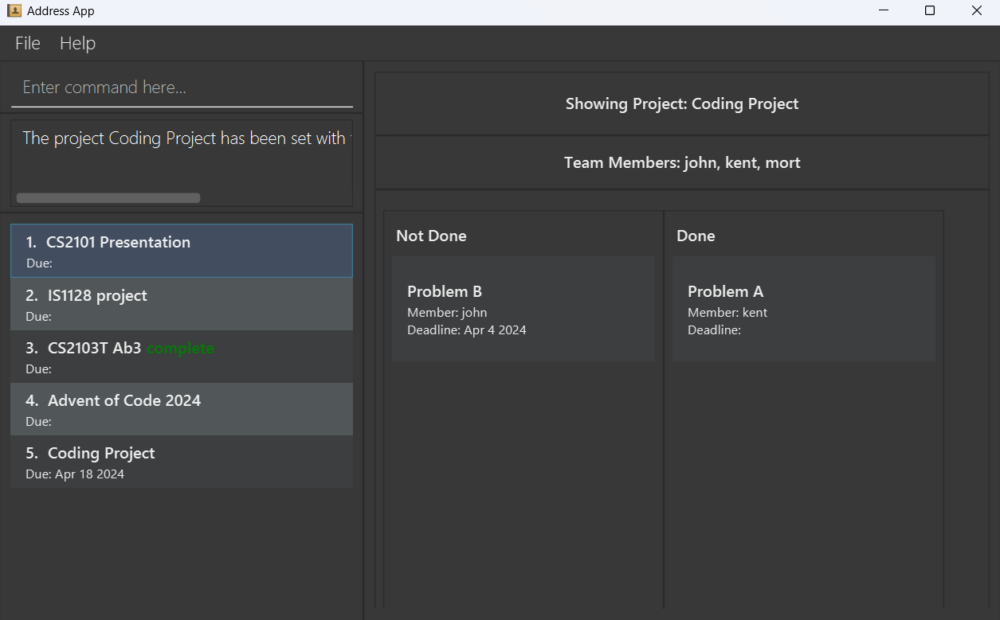
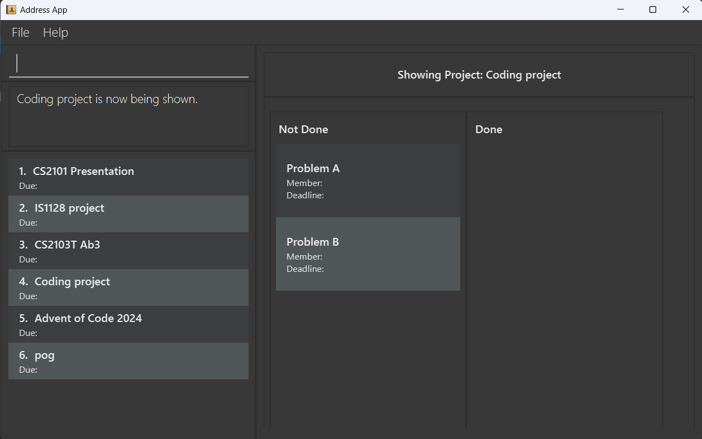

# DevPlan Pro User Guide

Welcome to the user guide for our CLI-based project management application! This tool is designed to streamline your project organization and task management, all from the command line interface. With a range of features tailored to enhance efficiency and collaboration, you can easily create, update, and monitor your projects and tasks.

## Table of Contents

<!-- TOC start (generated with https://github.com/derlin/bitdowntoc) -->

- [Quick start](#quick-start)
- [Features](#features)
  - [Adding a project: `add project`](#adding-a-project-add-project)
  - [Deleting a project : `delete project`](#deleting-a-project--delete-project)
  - [Add task : `add task`](#add-task--add-task)
  - [Remove task : `delete task`](#remove-task--delete-task)
  - [Show Project : `show project`](#show-project--show-project)
  - [Assign deadline to project : `add deadline`](#assign-deadline-to-project--add-deadline)
  - [Assign deadline to task : `add deadline`](#assign-deadline-to-task--add-deadline)
  - [Set Project Status : `set status`](#set-project-status--set-status)
  - [Set Task Status : `set status`](#set-task-status--set-status)
  - [Add member to project : `add person`](#add-member-to-project--add-person)
  - [Assign member to task : `assign person`](#assign-member-to-task--assign-person)
  - [Locating projects by name: `find project`](#locating-projects-by-name-find-project)
  - [Listing all projects : `list project`](#listing-all-projects--list-project)
- [FAQ](#faq)
- [Known issues](#known-issues)
- [Command summary](#command-summary)

<!-- TOC end -->

## Quick start

1. Ensure you have Java `11` or above installed in your Computer.

1. Download the latest `tp_new.jar` from [here](https://github.com/AY2324S2-CS2103T-W08-4/tp/releases/tag/v1.2).

1. Copy the file to the folder you want to use as the _home folder_ for your app.

1. Open a command terminal, `cd` into the folder you put the jar file in, and use the `java -jar tp_new.jar` command to run the application. 
   A GUI similar to the below should appear in a few seconds. Note how the app contains some sample data. 
   

1. Type the command in the command box and press Enter to execute it.
   Some example commands you can try:

   - `add project Duke` : Adds a project named `Duke` to the project list.

   - `delete project Duke` : Deletes the Duke project from the project list.

   - `clear` : Deletes all projects and tasks.

   - `exit` : Exits the app.

1. Refer to the [Features](#features) below for details of each command.

---

## Features

**:information_source: Notes about the command format:** 

- Words in `<UPPER_CASE>` are the parameters to be supplied by the user. 
  e.g. in `add project <PROJECT_NAME>`, `<PROJECT_NAME>` is a parameter which can be used as `add project CS2103`.

- Extraneous parameters for commands that do not take in parameters (namely `list project`) will be ignored. 
  e.g. if the command specifies `list project 123`, it will be interpreted as `list project`.

- If you are using a PDF version of this document, be careful when copying and pasting commands that span multiple lines as space characters surrounding line-breaks may be omitted when copied over to the application.

### Adding a project: `add project`

**Format:** `add project <PROJECT_NAME>`

⚠️ **Warning:** Project name needs to be unique.

⚠️ **Warning:** Project name is alphanumeric: slashes, commas, or any other punctuation mark aren't accepted.

**Examples:**

- `add project CS2103T Duke Chatbot Project`
- `add project CS2101 Presentation`

**Expected output:**

- Success: `<PROJECT_NAME> has been added to the project list.`
- Failure: `Project <PROJECT_NAME> already exists.`

### Deleting a project : `delete project`

**Format:** `delete project <PROJECT_NAME>`

⚠️ **Warning:** The project to be deleted must exist.

**Examples:**

- `delete project CS2101 Presentation`

**Expected output:**

- Success: `<PROJECT_NAME> has been deleted from the project list.`
- Failure: `Project <PROJECT_NAME> not found: Please make sure the project exists.`

### Add task : `add task`

Adds the specified task to a project.

**Format:** `add task <TASK_NAME> /to <PROJECT_NAME>`

⚠️ **Warning:** The specified project must exist.

⚠️ **Warning:** The task name has to be unique within the project.

⚠️ **Warning:** Task name is alphanumeric: slashes, commas, or any other punctuation mark aren't accepted.

**Examples:**

- `add task Prepare slides for presentation /to CS2101 Presentation`

**Expected output:**

- Success: `<TASK_NAME> has been added to <PROJECT_NAME>.`
- Failure:
  - `Project <PROJECT_NAME> not found: Please make sure the project exists.`
  - `Task <TASK_NAME> already exists in <PROJECT_NAME>.`

### Remove task : `delete task`

Deletes the specified task from a project.

**Format:** `delete task <TASK_NAME> /in <PROJECT_NAME>`

⚠️ **Warning:** The specified project must exist.

⚠️ **Warning:** The specified task must exist.

**Examples:**

- `delete task Prepare slides for presentation /in CS2101 Presentation`

**Expected output:**

- Success: `<TASK_NAME> has been deleted from <PROJECT_NAME>.`
- Failure:
  - `Project <PROJECT_NAME> not found: Please make sure the project exists.`
  - `Task <TASK_NAME> not found: Please make sure the task exists.`

### Show Project : `show project`

Sets the current showing project as the specified project.

⚠️ **Warning:** The specified project must exist.

**Format:** `show project <PROJECT_NAME>`

**Examples:**

- `show project CS2101 Presentation`

**Expected output:**

- Success: The UI now shows the project’s information.
- Failure: `Project <PROJECT_NAME> not found: Please make sure the project exists.`

Description: An example of the result after executing the "show project" command, displaying project information in the UI.

### Assign deadline to project : `add deadline`

**Format:** `add deadline <DEADLINE> /to <PROJECT_NAME>`

⚠️ **Warning:** The specified project must exist.

⚠️ **Warning:** The deadline must be in the `Mmm DD YYYY` format.

**Examples:**

- `add deadline Feb 25 2024 /to CS2103_TP`

**Expected output:**

- Success: `Deadline <DEADLINE> has been assigned to <PROJECT_NAME>.`
- Failure: `Deadline needs to be in MMM DD YYYY format.`
- Failure: `Project <PROJECT_NAME> not found: Please make sure the project exists.`

### Assign deadline to task : `add deadline`

**Format:** `add deadline <DEADLINE> /to <TASK_NAME> /in <PROJECT_NAME>`

⚠️ **Warning:** The specified project must exist.

⚠️ **Warning:** The specified task must exist.

⚠️ **Warning:** The deadline must be in the `Mmm DD YYYY` format.

**Examples:**

- `add deadline Feb 25 2024 /to submit feature list /in CS2103_TP`

**Expected output:**

- Success: `Deadline <DEADLINE> has been assigned to <PROJECT_NAME>:<TASK_NAME>.`
- Failure: `Deadline needs to be in MMM DD YYYY format.`
- Failure: `Project <PROJECT_NAME> not found: Please make sure the project exists.`
- Failure: `Task <TASK_NAME> not found: Please make sure the task exists.`

### Set Project Status : `set status`

**Format:** `set status <STATUS> /of <PROJECT_NAME>`

⚠️ **Warning:** The specified project must exist.

⚠️ **Warning:** The status can only be `complete` or `incomplete`.

**Examples:**

- `set status complete /of CS2103T Duke Chatbot Project`

**Expected output:**

- Success: `Project <PROJECT_NAME> is set as <STATUS>.`
- Failure:
  - `Project <PROJECT_NAME> not found: Please make sure the project exists.`
  - `Status was entered incorrectly.`

### Set Task Status : `set status`

⚠️ **Warning:** The specified project must exist.

⚠️ **Warning:** The specified task must exist.

⚠️ **Warning:** The status can only be `complete` or `incomplete`.

**Format:** `set status <STATUS> /of <TASK_NAME> /in <PROJECT_NAME>`

**Examples:**

- `set status complete /of unit test /in CS2103T Duke Chatbot Project`

**Expected output:**

- Success: `Task <TASK_NAME> is set as <STATUS>.`
- Failure:
  - `Task <TASK_NAME> not found: Please make sure the task exists.`
  - `Project <PROJECT_NAME> not found: Please make sure the project exists.`
  - `Status was entered incorrectly.`

### Add member to project : `add person`

**Format:** `add person <PERSON_NAME> /to <PROJECT_NAME>`

⚠️ **Warning:** The specified project must exist.

⚠️ **Warning:** Person name must be unique within the project.

**Examples:**

- `add person Joe /to CS2103_TP`

**Expected output:**

- Success: `<PERSON_NAME> has been added to <PROJECT_NAME>`
- Failure: `Project <PROJECT_NAME> does not exist.`

### Assign member to task : `assign person`

**Format:** `assign person <PERSON_NAME> /to <TASK_NAME> /in <PROJECT_NAME>`

⚠️ **Warning:** The specified project must exist.

⚠️ **Warning:** The specified task must exist.

**Examples:**

- `assign person Joe /to unit test /in CS2103_TP`

**Expected output:**

- Success: `<PERSON_NAME> has been assigned to <PROJECT_NAME>: <TASK_NAME>.`
- Failure: `Person <PERSON_NAME> is not a team member.`

### Locating projects by name: `find project`

Finds projects whose names contain any of the given keywords. The updated project list will show the projects that matches. To see the full project list, use [list project command.](#listing-all-projects--list-project)

**Format:** `find project [KEYWORDS]`

**Examples:**

- `find project CS2103`

**Expected output:**

- Returns projects containing the specified keyword(s).

### Listing all projects : `list project`

Shows a list of all projects in the project list.

**Format:** `list project`

---

## FAQ

**Q**: How do I transfer my data to another Computer? 
**A**: Install the app in the other computer and overwrite the empty data file it creates with the file that contains the data of your previous DevPlan Pro home folder.

---

## Known issues

1. **When using multiple screens**, if you move the application to a secondary screen, and later switch to using only the primary screen, the GUI will open off-screen. The remedy is to delete the `preferences.json` file created by the application before running the application again.

---

## Command summary

| Action                      | Format, Examples                                                                                                                                |
| --------------------------- | ----------------------------------------------------------------------------------------------------------------------------------------------- |
| **Add project**             | `add project <PROJECT_NAME>`   Example: `add project CS2101 Presentation`                                                                    |
| **Delete project**          | `delete project <PROJECT_NAME>`   Example: `delete project CS2101 Presentation`                                                              |
| **Add task**                | `add task <TASK_NAME> /to <PROJECT_NAME>`   Example: `add task Prepare slides for presentation /to CS2101 Presentation`                      |
| **Delete task**             | `delete task <TASK_NAME> /in <PROJECT_NAME>`   Example: `delete task Prepare slides for presentation /in CS2101 Presentation`                |
| **Show project**            | `show project <PROJECT_NAME>`   Example: `show project CS2101 Presentation`                                                                  |
| **Set deadline of project** | `set deadline <DEADLINE> /of <PROJECT_NAME>`   Example: `add deadline to project CS2101 Presentation Apr 10 2024`                            |
| **Set deadline of task**    | `set deadline <DEADLINE> /of <TASK_NAME> /in <PROJECT_NAME>`   Example: `add deadline to task 1 Apr 10 2024 /in CS2101 Presentation`         |
| **Add member to project**   | `add person <PERSON_NAME> /to <PROJECT_NAME>`   Example: `add person to project John /to CS2101 Presentation`                                |
| **Assign member to task**   | `assign person <PERSON_NAME> /to <TASK_NAME> /in <PROJECT_NAME>`   Example: `assign person Alice /to Prepare slides /in CS2101 Presentation` |
| **Set status of project**   | `set status <STATUS> /of <PROJECT_NAME>`   Example: `set status Completed /of CS2101 Presentation`                                           |
| **Set status of task**      | `set status <STATUS> /of <TASK_NAME> /in <PROJECT_NAME>`   Example: `set status Completed /of Prepare slides /in CS2101 Presentation`        |
| **Find project**            | `find project <SEARCH_TERM>`   Example: `find project Presentation`                                                                          |
| **List project**            | `list project`                                                                                                                                  |
