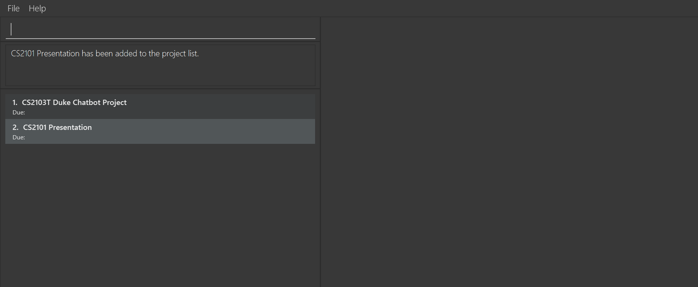
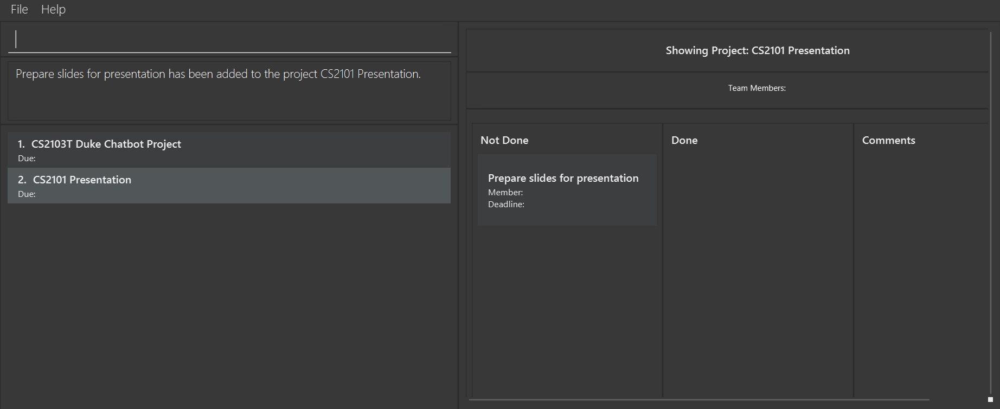
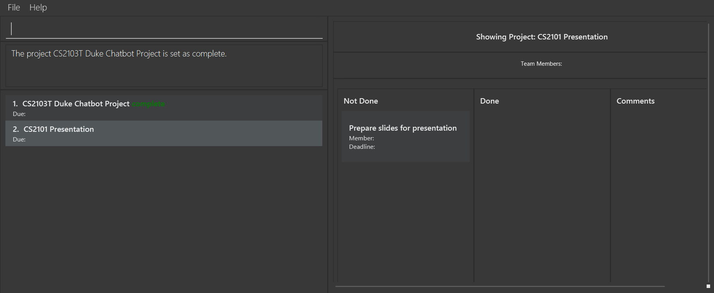
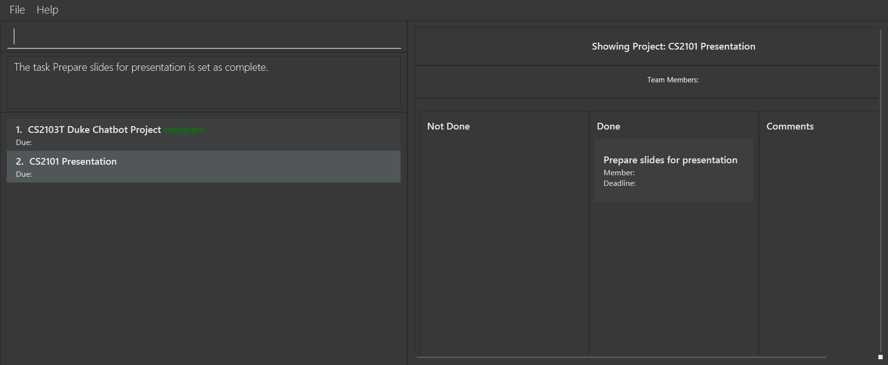
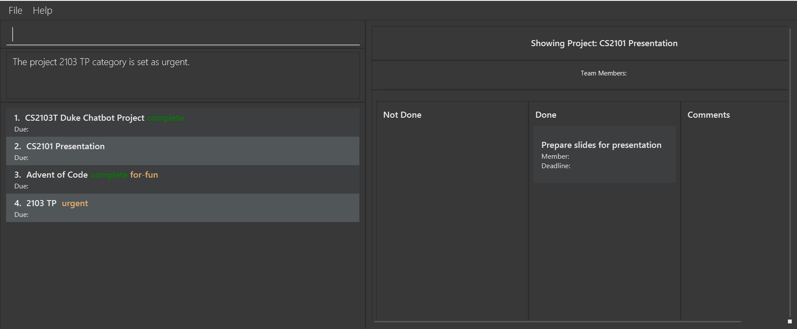
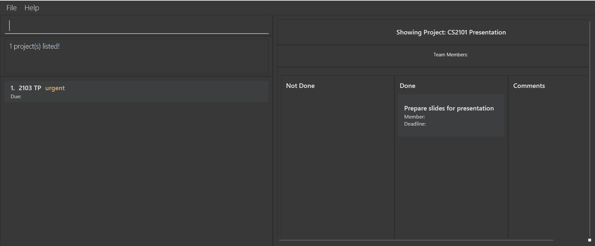
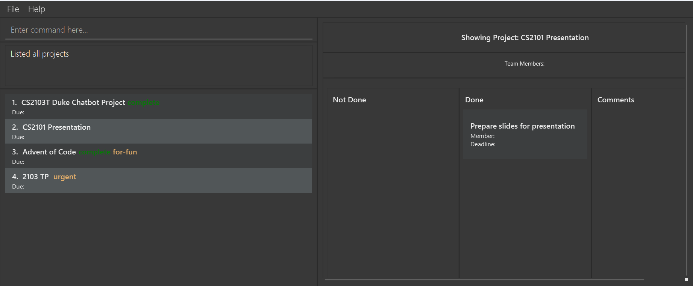

# DevPlan Pro User Guide

Welcome to the user guide for our CLI-based project management application! This tool is designed to streamline your project organization and task management, all from the command line interface. With a range of features tailored to enhance efficiency and collaboration, you can easily create, update, and monitor your projects and tasks.

## Table of Contents

<!-- TOC start (generated with https://github.com/derlin/bitdowntoc) -->

- [Tips on using this User Guide](#tips-on-using-this-user-guide)
- [Quick start](#quick-start)
- [Features](#features)
  - [Adding a project: `add project`](#adding-a-project-add-project)
  - [Deleting a project : `delete project`](#deleting-a-project--delete-project)
  - [Show Project : `show project`](#show-project--show-project)
  - [Add task : `add task`](#add-task--add-task)
  - [Delete task : `delete task`](#delete-task--delete-task)
  - [Set deadline to project : `set deadline`](#set-deadline-to-project--set-deadline)
  - [Set deadline to task : `set deadline`](#set-deadline-to-task--set-deadline)
  - [Set Project Status : `set status`](#set-project-status--set-status)
  - [Set Task Status : `set status`](#set-task-status--set-status)
  - [Assign team to project: `assign team`](#assign-team-to-project-assign-team)
  - [Add member to project : `add person`](#add-member-to-project--add-person)
  - [Remove member from project : `delete person`](#remove-member-from-project--delete-person)
  - [Assign member to task : `assign person`](#assign-member-to-task--assign-person)
  - [Rename a project: `set name`](#rename-a-project-set-name)
  - [Rename a task: `set name`](#rename-a-task-set-name)
  - [Set project category: `set category`](#set-project-category-set-category)
  - [Filter projects by category: `filter category`](#filter-projects-by-category-filter-category)
  - [Add comments to project: `add comment`](#add-comments-to-project-add-comment)
  - [Locating projects by name: `find project`](#locating-projects-by-name-find-project)
  - [Listing all projects: `list project`](#listing-all-projects-list-project)
  - [Clear project list: `clear project`](#clear-project-list-clear-project)
  - [Show help: `show help`](#show-help-show-help)
  - [Exit DevPlan Pro: `exit program`](#exit-devplan-pro-exit-program)
- [FAQ](#faq)
- [Known issues](#known-issues)
- [Command summary](#command-summary)

<!-- TOC end -->

## Tips on using this User Guide

- Follow the [Quick start](#quick-start) to get DevPlan Pro set up on your device.
- Check out the detailed command list from the [Features](#features) section.
- For get to a more specific command or section quickly, click the corresponding section in the [Table of Contents](#table-of-contents)
- If you are finding unexpected behaviors in the UI or the app itself, try checking out the [FAQ](#faq) or the [Known issues](#known-issues) section.

## Quick start

1. Ensure you have Java `11` or above installed in your Computer.

2. Download the latest `tp_new.jar` from [here](https://github.com/AY2324S2-CS2103T-W08-4/tp/releases/tag/v1.2).

3. Copy the file to the folder you want to use as the _home folder_ for your app.

4. Open a command terminal, `cd` into the folder you put the jar file in, and use the `java -jar tp_new.jar` command to run the application. 
   A GUI similar to the below should appear in a few seconds. Note how the app contains some sample data. 
   
   Some notes about the UI:

   - On the top left is the menu bar. There are 2 buttons: File and Help. File can be used as an alternative way to exit the app, and Help is used to open up the help window.
   - Below the menu bar is the command box. This is where you will be typing the commands to use the app. See 5. for more details.
   - Below the command box is the result box. In the [Features](#features) section the "expected result" of each commands will be stated. Those results are expected to be displayed here in this result box.
   - Below the result box is the project list. This is where your projects will appear after you've added them.
   - Now on the right side is the details of the project. To choose which project you would like to see the details, use the [show project](#show-project--show-project) command.

   ⚠️ If you are finding unexpected behaviors in the UI or the app itself, try checking out the [FAQ](#faq) or the [Known issues](#known-issues) sections of this User Guide.

5. Type the command in the command box and press Enter to execute it.
   Some example commands you can try:

   - `add project Duke` : Adds a project named `Duke` to the project list.

   - `delete project Duke` : Deletes the Duke project from the project list.

   - `clear project` : Deletes all projects and tasks.

   - `exit program` : Exits the app.

6. Refer to the [Features](#features) section below for details of each command.

---

## Features

**:information_source: Notes about the commands:** 

- Words in `<UPPER_CASE>` are the parameters to be supplied by you, the user. 
  e.g. in `add project <PROJECT_NAME>`, `<PROJECT_NAME>` is a parameter which can be used as `add project CS2103`.

- Extraneous parameters for commands that do not take in parameters (namely `list project`) will be ignored. 
  e.g. if the command specifies `list project 123`, it will be interpreted as `list project`.

- If you are using a PDF version of this document, be careful when copying and pasting commands that span multiple lines as space characters surrounding line-breaks may be omitted when copied over to the application.

### Adding a project: `add project`

The added projects will appear on the project list on the left.

**Format:** `add project <PROJECT_NAME>`

⚠️ **Warning:** Project name needs to be unique.

⚠️ **Warning:** Project name is alphanumeric: slashes, commas, or any other punctuation mark aren't accepted.

⚠️ **Warning:** A long project name can result in incomplete display of the project name, status, and category. To see more text, you can resize the window horizontally or maximize the window.

**Examples:**

- `add project CS2103T Duke Chatbot Project`
- `add project CS2101 Presentation`

**Expected output:**

- Success: `<PROJECT_NAME> has been added to the project list.`
- Failure:
  - `Project <PROJECT_NAME> already exists.`
  - `Project name should be alphanumerical and not empty.`

Description: An example of the result after executing the "add project" command.

### Deleting a project : `delete project`

**Format:** `delete project <PROJECT_NAME>`

⚠️ **Warning:** The project to be deleted must exist.

**Examples:**

- `delete project CS2101 Presentation`

**Expected output:**

- Success: `<PROJECT_NAME> has been deleted from the project list.`
- Failure: `Project <PROJECT_NAME> not found: Please make sure the project exists.`

### Show Project : `show project`

Sets the current showing project as the specified project.

⚠️ **Warning:** The specified project must be in the current project list. Try using `list project` before using this command if you couldn't see your project in the current project list.

**Format:** `show project <PROJECT_NAME>`

**Examples:**

- `show project CS2101 Presentation`

**Expected output:**

- Success: The UI now shows the project’s information.
- Failure:
  - `Project <PROJECT_NAME> not found: Please make sure the project exists.`
  - `Please enter the project field.`

Description: An example of the result after executing the "show project" command, displaying project information in the UI.

### Add task : `add task`

Adds the specified task to a project.

**Format:** `add task <TASK_NAME> /to <PROJECT_NAME>`

⚠️ **Warning:** The specified project must exist.

⚠️ **Warning:** Task name has to be unique within the project.

⚠️ **Warning:** Task name is alphanumeric: slashes, commas, or any other punctuation mark aren't accepted.

⚠️ **Warning:** Task name should be within 30 characters long. A longer name can result in incomplete display (see [known-issues](#known-issues)).

**Examples:**

- `add task Prepare slides for presentation /to CS2101 Presentation`

**Expected output:**

- Success: `<TASK_NAME> has been added to <PROJECT_NAME>.`
- Failure:
  - `Project <PROJECT_NAME> not found: Please make sure the project exists.`
  - `Task <TASK_NAME> already exists in <PROJECT_NAME>.`
  - `Please enter the task and project fields.`
  - `Names should be alphanumerical and not empty.`

### Delete task : `delete task`

Deletes the specified task from a project.

**Format:** `delete task <TASK_NAME> /in <PROJECT_NAME>`

⚠️ **Warning:** The specified project must exist.

⚠️ **Warning:** The specified task must exist.

**Examples:**

- `delete task Prepare slides for presentation /in CS2101 Presentation`

**Expected output:**

- Success: `<TASK_NAME> has been deleted from <PROJECT_NAME>.`
- Failure:
  - `Project <PROJECT_NAME> not found: Please make sure the project exists.`
  - `Task <TASK_NAME> not found: Please make sure the task exists.`
  - `Please enter the project and the task field`

### Set deadline to project : `set deadline`

**Format:** `set deadline <DEADLINE> /to <PROJECT_NAME>`

⚠️ **Warning:** The specified project must exist.

⚠️ **Warning:** The deadline must be in the `Mmm DD YYYY` format.

⚠️ **Warning:** This deadline is considered a separate deadline from the [task deadline](#set-deadline-to-task--set-deadline); there will be no checks to make sure the tasks are dued before the project.

**Examples:**

- `set deadline Feb 25 2024 /to CS2103_TP`

**Expected output:**

- Success: `The project <PROJECT_NAME> has been set with the following deadline <DEADLINE>.`
- Failure:
  - `The deadline <DEADLINE> has been entered in the wrong format. An example of the correct format is Mar 15 2024.`
  - `Project <PROJECT_NAME> not found: Please make sure the project exists.`
  - `Please enter the project field.`
  - `Please enter valid date.`

### Set deadline to task : `set deadline`

**Format:** `set deadline <DEADLINE> /to <TASK_NAME> /in <PROJECT_NAME>`

⚠️ **Warning:** The specified project must exist.

⚠️ **Warning:** The specified task must exist.

⚠️ **Warning:** The deadline must be in the `Mmm DD YYYY` format.

⚠️ **Warning:** This deadline is considered a separate deadline from the [project deadline](#set-deadline-to-project--set-deadline); there will be no checks to make sure the tasks are dued before the project.

**Examples:**

- `set deadline Feb 25 2024 /to submit feature list /in CS2103_TP`

**Expected output:**

- Success: `Deadline <DEADLINE> has been assigned to <PROJECT_NAME>:<TASK_NAME>.`
- Failure:
  - `The deadline <DEADLINE> has been entered in the wrong format. An example of the correct format is Mar 15 2024`
  - `Project <PROJECT_NAME> not found: Please make sure the project exists.`
  - `Task <TASK_NAME> not found: Please make sure the task exists.`
  - `Please enter the project and task fields.`

### Set Project Status : `set status`

Projects set as `complete` will have a green `complete` status text beside its name. New projects are initially set as `incomplete`.

**Format:** `set status <STATUS> /of <PROJECT_NAME>`

⚠️ **Warning:** The specified project must exist.

⚠️ **Warning:** The status can only be `complete` or `incomplete`.

**Examples:**

- `set status complete /of CS2103T Duke Chatbot Project`

**Expected output:**

- Success: `Project <PROJECT_NAME> is set as <STATUS>.`
- Failure:
  - `Project <PROJECT_NAME> not found: Please make sure the project exists.`
  - `The status has been entered in the wrong format.`
  - `Please enter a valid status: complete/incomplete.`
  - `Please enter the status and project fields.`

### Set Task Status : `set status`

Tasks set as `complete` will me moved to the `Done` column on the right side of the ui. New tasks are initially set as `incomplete`.

⚠️ **Warning:** The specified project must exist.

⚠️ **Warning:** The specified task must exist.

⚠️ **Warning:** The status can only be `complete` or `incomplete`.

**Format:** `set status <STATUS> /of <TASK_NAME> /in <PROJECT_NAME>`

**Examples:**

- `set status complete /of Prepare slides for presentation /in CS2101 Presentation`

**Expected output:**

- Success: `Task <TASK_NAME> is set as <STATUS>.`
- Failure:
  - `Task <TASK_NAME> not found: Please make sure the task exists.`
  - `Project <PROJECT_NAME> not found: Please make sure the project exists.`
  - `The status has been entered in the wrong format.`
  - `Please enter a valid status: complete/incomplete.`
  - `Please enter the status, project and task fields.`

### Assign team to project: `assign team`

**Format:** `assign team <PERSON_NAME_1>[, <PERSON_NAME_2>, <PERSON_NAME_3>, ...] /to <PROJECT_NAME>`

⚠️ **Warning:** The specified project must exist.

🔔 **Warning**: Each person name cannot be empty.

⚠️ **Warning:** This will override the current member list of the project; if `Joe` and `Linda` were members of project `CS2103` before `assign team Paul /to CS2103` is called, `Joe` and `Linda` will be removed from the project.

⚠️ **Warning:** Duplicate person names are allowed, but not recommended. It can cause confusion for both you and the app.

⚠️ **Warning:** Each person name is alphanumeric: slashes, commas, or any other punctuation mark aren't accepted.

🔔 **Note**: The part of the format in `[ ]` is optional

⚠️ **Warning:** Each person name should be within 25 characters long. A longer name can result in incomplete display (see [known-issues](#known-issues)).

**Examples:**

- `assign team Joe, Cody /to CS2103_TP`

**Expected output:**

- Success: `The team <PERSON_NAME_1>[, <PERSON_NAME_2>, <PERSON_NAME_3>, ...] has been added to <PROJECT_NAME>`
- Failure:
  - `Project <PROJECT_NAME> not found: Please make sure the project exists.`
  - `Whoops! When referring to another field like a project always remember to put /to instead of just to.`
  - `Please enter valid names.`
  - `Please enter the project and team fields.`

### Add member to project : `add person`

**Format:** `add person <PERSON_NAME> /to <PROJECT_NAME>`

⚠️ **Warning:** The specified project must exist.

⚠️ **Warning:** Duplecate person names are allowed, but not recommended. It can cause confusion for both you and the app.

⚠️ **Warning:** Person name is alphanumeric: slashes, commas, or any other punctuation mark aren't accepted.

⚠️ **Warning:** Person name should be within 25 characters long. A longer name can result in incomplete display (see [known-issues](#known-issues)).

**Examples:**

- `add person Joe /to CS2103_TP`

**Expected output:**

- Success: `The person <PERSON_NAME> has been assigned to the following project <PROJECT_NAME>`
- Failure:
  - `Project <PROJECT_NAME> not found: Please make sure the project exists.`
  - `Please enter the member and project fields.`

### Remove member from project : `delete person`

**Format:** `delete person <PERSON_NAME> /in <PROJECT_NAME>`

⚠️ **Warning:** The specified project must exist.

⚠️ **Warning:** The specified person must exist in the project.

⚠️ **Warning:** Removing duplicate name will only remove the first instance of the name.

**Examples:**

- `delete person Joe /in CS2103_TP`

**Expected output:**

- Success: `<PERSON_NAME> has been deleted from <PROJECT_NAME>`
- Failure:
  - `Project <PROJECT_NAME> not found: Please make sure the project exists.`
  - `Member <PERSON_NAME> not found: Please make sure the person exists in project <PROJECT_NAME>.`
  - `Please enter the member and the project field.`

### Assign member to task : `assign person`

**Format:** `assign person <PERSON_NAME> /to <TASK_NAME> /in <PROJECT_NAME>`

⚠️ **Warning:** The specified project must exist.

⚠️ **Warning:** The specified task must exist in the project.

⚠️ **Warning:** The specified person must exist in the project.

⚠️ **Warning:** Only the latest member will be assigned to the task; Using `assign person Joe /to unit test /in CS2103_TP` before `assign person Paul /to unit test /in CS2103_TP` will result in only Paul being assigned to the task.

**Examples:**

- `assign person Joe /to unit test /in CS2103_TP`

**Expected output:**

- Success: `<PERSON_NAME> has been assigned to <PROJECT_NAME>: <TASK_NAME>.`
- Failure:
  - `Project <PROJECT_NAME> not found: Please make sure the project exists.`
  - `Task <TASK_NAME> not found: Please make sure the task exists`
  - `Member <PERSON_NAME> not found: Please make sure the person exists.`
  - `Whoops! When referring to another field like a task, always remember to put /to instead of just to. When referring to a project, use /in instead of just in.`
  - `Please enter the task, project and member fields.`

### Rename a project: `set name`

**Format:** `set name <NEW_NAME> /of <PROJECT_NAME>`

⚠️ **Warning:** The specified project must exist.

**Examples:**

- `set name f2103 /of CS2103_TP`

**Expected output:**

- Success: `Project <PROJECT_NAME> has been renamed to <NEW_NAME>`
- Failure:
  - `Project <PROJECT_NAME> not found: Please make sure the project exists.`
  - `Project <PROJECT_NAME> already exists: Please set the name of the project to be unique.`
  - `Whoops! When referring to another field like a project or task, always remember to put /of instead of just of.`
  - `Please enter both the target and new project name or both target task and the project it belongs to if you want to rename a specific task.`

### Rename a task: `set name`

**Format:** `set name <NEW_NAME> /of <TASK_NAME> /in <PROJECT_NAME>`

⚠️ **Warning:** The specified project must exist.

⚠️ **Warning:** The specified task must exist in the project.

**Examples:**

- `set name fix UG bugs /of fix IG bugs /in CS2103_TP`

**Expected output:**

- Success: `Task <NEW_NAME> of project <PROJECT_NAME> has been renamed to <TASK_NAME>`
- Failure:
  - `Project <PROJECT_NAME> not found: Please make sure the project exists.`
  - `Task <TASK_NAME> not found: Please make sure the task exists in project <PROJECT_NAME>`
  - `Task <TASK_NAME> already exists. Please set the name of the task in project %2$s to be unique.`
  - `Whoops! When referring to another field like a project or task, always remember to put /of instead of just of.`
  - `Please enter both the target and new project name or both target task and the project it belongs to if you want to rename a specific task.`
  - `Please enter both the target task name and the project it belongs to.`

### Set project category: `set category`

Similar to adding a tag to the project. The category will be shown as the orange text beside the project's name (it comes after the project status).

**Format:** `set category <CATEGORY> /to <PROJECT_NAME>`

⚠️ **Warning:** The specified project must exist.

⚠️ **Warning:** Each project is limited to one category. Setting a new category overrides the old one.

⚠️ **Warning:** A long category can result in incomplete display of the project name, status, and category. To see more text, you can resize the window horizontally or maximize the window.

**Examples:**

- `set category urgent /to 2103 TP`

**Expected output:**

- Success: `The project <PROJECT_NAME> category is set as <CATEGORY>.`
- Failure:
  - `Project <PROJECT_NAME> not found: Please make sure the project exists.`
  - `Please enter the project field.`

### Filter projects by category: `filter category`

**Format:** `filter category <CATEGORY>`

**Examples:**

- `filter category urgent`

**Expected output:**

The project list will list the projects with the specified category.

### Add comments to project: `add comment`

**Format:** `add comment <COMMENT> /from <MEMBER_NAME> /to <PROJECT_NAME>`

⚠️ **Warning:** The specified project must exist.

⚠️ **Warning:** The specified member must exist in the project.

⚠️ **Warning:** The comments will not be deleted even if the person who made the comment is removed from the project.

**Examples:**

- `add comment delete task can only be started after add task is implemented /from Mary /to 2103`

**Expected output:**

- Success: `The comment <COMMENT> has been added to the project <PROJECT_NAME>.`
- Failure:
  - `Project <PROJECT_NAME> not found: Please make sure the project exists.`
  - `Team member <MEMBER_NAME> not found: Please make sure the person exists.`
  - `Please enter a comment.`

### Locating projects by name: `find project`

Finds projects whose names contain any of the given keywords. The updated project list will show the projects that matches. To see the full project list, use [list project command.](#listing-all-projects--list-project)

**Format:** `find project [KEYWORDS]`

**Examples:**

- `find project CS2103`

**Expected output:**

- The project list will list the projects containing the specified keyword(s).

### Listing all projects: `list project`

Shows a list of all projects in the project list.

**Format:** `list project`

### Clear project list: `clear project`

Clears the project list, making the project list empty.

**Format:** `clear project`

### Show help: `show help`

Opens a help window containing the url to this user guide.

**Format:** `show help`

### Exit DevPlan Pro: `exit program`

**Format:** `exit program`

---

## FAQ

**Q**: How do I transfer my data to another Computer? 
**A**: Install the app in the other computer and overwrite the empty data file it creates with the file that contains the data of your previous DevPlan Pro home folder.

---

## Known issues

1. **When using multiple screens**, if you move the application to a secondary screen, and later switch to using only the primary screen, the GUI will open off-screen. The remedy is to delete the `preferences.json` file created by the application before running the application again.

2. **When viewing tasks in the UI**, if the name of the task is longer than 30 characters, the UI will not be able to display the full name of the task. A similar limit of 25 characters is applied to the name of the member set to the task.

---

## Command summary

| Action                          | Format, Examples                                                                                                                                                             |
| ------------------------------- | ---------------------------------------------------------------------------------------------------------------------------------------------------------------------------- |
| **Add project**                 | `add project <PROJECT_NAME>`   Example: `add project CS2101 Presentation`                                                                                                 |
| **Delete project**              | `delete project <PROJECT_NAME>`   Example: `delete project CS2101 Presentation`                                                                                           |
| **Add task**                    | `add task <TASK_NAME> /to <PROJECT_NAME>`   Example: `add task Prepare slides for presentation /to CS2101 Presentation`                                                   |
| **Delete task**                 | `delete task <TASK_NAME> /in <PROJECT_NAME>`   Example: `delete task Prepare slides for presentation /in CS2101 Presentation`                                             |
| **Show Project**                | `show project <PROJECT_NAME>`   Example: `show project CS2101 Presentation`                                                                                               |
| **Set deadline to project**     | `set deadline <DEADLINE> /to <PROJECT_NAME>`   Example: `set deadline Feb 25 2024 /to CS2103_TP`                                                                          |
| **Set deadline to task**        | `set deadline <DEADLINE> /to <TASK_NAME> /in <PROJECT_NAME>`   Example: `Set deadline Feb 25 2024 /to submit feature list /in CS2103_TP`                                  |
| **Set Project Status**          | `set status <STATUS> /of <PROJECT_NAME>`   Example: `set status complete /of CS2103T Duke Chatbot Project`                                                                |
| **Set Task Status**             | `set status <STATUS> /of <TASK_NAME> /in <PROJECT_NAME>`   Example: `set status complete /of unit test /in CS2103T Duke Chatbot Project`                                  |
| **Assign team to project**      | `assign team <PERSON_NAME_1>[, <PERSON_NAME_2>, <PERSON_NAME_3>, ...] /to <PROJECT_NAME>`   Example: `assign team Joe, Cody /to CS2103_TP`                                |
| **Add member to project**       | `add person <PERSON_NAME> /to <PROJECT_NAME>`   Example: `add person Joe /to CS2103_TP`                                                                                   |
| **Remove member from project**  | `delete person <PERSON_NAME> /in <PROJECT_NAME>`   Example: `delete person Joe /in CS2103_TP`                                                                             |
| **Assign member to task**       | `assign person <PERSON_NAME> /to <TASK_NAME> /in <PROJECT_NAME>`   Example: `assign person Joe /to unit test /in CS2103_TP`                                               |
| **Rename a project**            | `set name <NEW_NAME> /of <PROJECT_NAME>`   Example: `set name f2103 /of CS2103_TP`                                                                                        |
| **Rename a task**               | `set name <NEW_NAME> /of <TASK_NAME> /in <PROJECT_NAME>`   Example: `set name assign person command /of add person command /in CS2103_TP`                                 |
| **Set project category**        | `set category <CATEGORY> /to <PROJECT_NAME>`   Example: `set category urgent /to 2103`                                                                                    |
| **Filter projects by category** | `filter category <CATEGORY>`   Example: `filter category urgent`                                                                                                          |
| **Add comments to project**     | `add comment <COMMENT> /from <MEMBER_NAME> /to <PROJECT_NAME>`   Example: `add comment delete task can only be started after add task is implemented /from Mary /to 2103` |
| **Locating projects by name**   | `find project [KEYWORDS]`   Example: `find project CS2103`                                                                                                                |
| **Listing all projects**        | `list project`                                                                                                                                                               |
| **Clear project list**          | `clear project`                                                                                                                                                              |
| **Show help**                   | `show help`                                                                                                                                                                  |
| **Exit DevPlan Pro**            | `exit program`                                                                                                                                                               |
