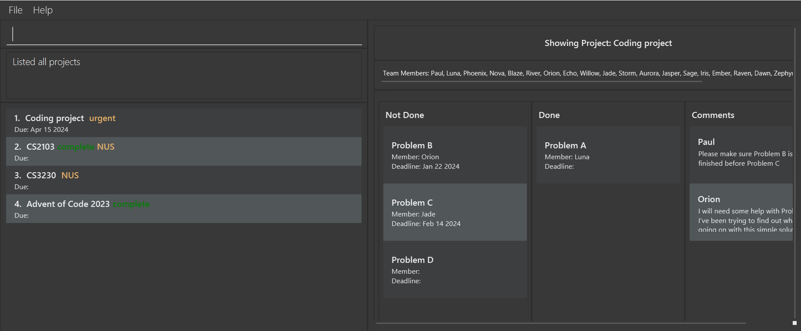

# DevPlan Pro User Guide

Welcome to the user guide for our CLI-based project management application! This tool is designed to streamline your project organization and task management, all from the command line interface. With a range of features tailored to enhance efficiency and collaboration, you can easily create, update, and monitor your projects and tasks.

## Table of Contents

<!-- TOC start (generated with https://github.com/derlin/bitdowntoc) -->

- [Quick start](#quick-start)
- [Features](#features)
  - [Adding a project: `add project`](#adding-a-project-add-project)
  - [Deleting a project : `delete project`](#deleting-a-project--delete-project)
  - [Add task : `add task`](#add-task--add-task)
  - [Remove task : `delete task`](#remove-task--delete-task)
  - [Show Project : `show project`](#show-project--show-project)
  - [Assign deadline to project : `add deadline`](#assign-deadline-to-project--add-deadline)
  - [Assign deadline to task : `add deadline`](#assign-deadline-to-task--add-deadline)
  - [Set Project Status : `set status of Project`](#set-project-status--set-status-of-project)
  - [Set Task Status : `set status of Task`](#set-task-status--set-status-of-task)
  - [Add member to project : `add person`](#add-member-to-project--add-person)
  - [Assign member to task : `add person`](#assign-member-to-task--add-person)
  - [Locating projects by name: `find`](#locating-projects-by-name-find)
  - [Listing all persons : `list`](#listing-all-persons--list)
- [FAQ](#faq)
- [Known issues](#known-issues)
- [Command summary](#command-summary)

<!-- TOC end -->

## Quick start

1. Ensure you have Java `11` or above installed in your Computer.

1. Download the latest `tp_new.jar` from [here](https://github.com/AY2324S2-CS2103T-W08-4/tp/releases/tag/v1.2).

1. Copy the file to the folder you want to use as the _home folder_ for your app.

1. Open a command terminal, `cd` into the folder you put the jar file in, and use the `java -jar tp_new.jar` command to run the application. 
   A GUI similar to the below should appear in a few seconds. Note how the app contains some sample data. 
   

1. Type the command in the command box and press Enter to execute it.
   Some example commands you can try:

   - `add project Duke` : Adds a project named `Duke` to the DevPlanPro.

   - `delete project Duke` : Deletes the Duke project from the list.

   - `clear` : Deletes all projects and tasks.

   - `exit` : Exits the app.

1. Refer to the [Features](#features) below for details of each command.

---

## Features

**:information_source: Notes about the command format:** 

- Words in `UPPER_CASE` are the parameters to be supplied by the user. 
  e.g. in `add n/NAME`, `NAME` is a parameter which can be used as `add n/John Doe`.

- Items in square brackets are optional. 
  e.g `n/NAME [t/TAG]` can be used as `n/John Doe t/friend` or as `n/John Doe`.

- Items with `…`​ after them can be used multiple times including zero times. 
  e.g. `[t/TAG]…​` can be used as ` ` (i.e. 0 times), `t/friend`, `t/friend t/family` etc.

- Parameters can be in any order. 
  e.g. if the command specifies `n/NAME p/PHONE_NUMBER`, `p/PHONE_NUMBER n/NAME` is also acceptable.

- Extraneous parameters for commands that do not take in parameters (such as `help`, `exit` and `clear`) will be ignored. 
  e.g. if the command specifies `help 123`, it will be interpreted as `help`.

- If you are using a PDF version of this document, be careful when copying and pasting commands that span multiple lines as space characters surrounding line-breaks may be omitted when copied over to the application.

### Adding a project: `add project`

Adds a project to the project manager.

Format: `add project <PROJECT_NAME>`

Examples:

- `add project CS2103T Duke Chatbot Project`
- `add project CS2101 Presentation`

Expected output:

- Success: `<PROJECT_NAME> has been added to the project list.`
- Failure: `Project <PROJECT_NAME> already exists.`

### Deleting a project : `delete project`

Deletes the specified project from the project list.

Format: `delete project <PROJECT_NAME>`

- The specified project name must exist in the project list.

Examples:

- `delete project CS2101 Presentation`

Expected output:

- Successful deletion: `<PROJECT_NAME> has been deleted from the project list.`
- Failed deletion: `Project <PROJECT_NAME> not found: Please make sure the project exists.`

### Add task : `add task`

Add the specified task to a project.

Format: `add task <TASK_NAME> /to <PROJECT_NAME>`

- The specified project name must exist in the project list.
- The task's name must be unique
  Examples:
- `add task add deadline command /to CS2103T Duke Chatbot Project`

Expected output:

- Successful add command: `<TASK_NAME> has been added to <PROJECT_NAME>`
- Failed commands:
  - invalid project name: `Project <PROJECT_NAME> not found: Please make sure the project exists.`
  - repeated task: `Task <TASK_NAME> already exists in <PROJECT_NAME>`

### Remove task : `delete task`

Deletes the specified task from a project.

Format: `delete task <TASK_NAME> /in <PROJECT_NAME>`

- The specified project name must exist in the project list.
- The task name must exist
  Examples:
- `delete task add deadline command /in CS2103T Duke Chatbot Project`

Expected output:

- Successful deletion: `<TASK_NAME> has been deleted from <PROJECT_NAME>`
- Failed commands:
  - invalid project name: `Project <PROJECT_NAME> not found: Please make sure the project exists.`
  - invalid task name: `Task <TASK_NAME> not found: Please make sure the task exists`

### Show Project : `show project`

shows the project’s details

Format: `show project <PROJECT_NAME>`

- The specified project name must exist in the project list.

Examples:

- `show project CS2103T Duke Chatbot Project`

Expected output:

- Successful display: `The ui now shows the project’s information`
- Failed commands: `Project <PROJECT_NAME> not found: Please make sure the project exists.`

### Assign deadline to project : `add deadline`

Assigns a deadline to a project.

Format: `add deadline <DEADLINE> /to <PROJECT_NAME>`

- The specified project name must exist in the project list.
- The deadline must be in `MMM D YYYY` format

Examples:

- `add deadline Feb 25 2024 /to CS2103_TP`

Expected output:

- Successful assignment: `Deadline <DEADLINE> has been assigned to <PROJECT_NAME>`
- Failed assignment (example): `Deadline needs to be in MMM D YYYY format.`

### Assign deadline to task : `add deadline`

Assigns a deadline to a task in a project.

Format: `add deadline <DEADLINE> /to <TASK_NAME> /in <PROJECT_NAME>`

- The specified project name must exist in the project list.
- The specified task name must exist in the project's tasks.
- The deadline must be in `MMM D YYYY` format

Examples:

- `add deadline Feb 25 2024 /to submit feature list /in CS2103_TP`

Expected output:

- Successful assignment: `Deadline <DEADLINE> has been assigned to <PROJECT_NAME>:<TASK_NAME>`
- Failed assignment (example): `Deadline needs to be in MMM D YYYY format.`

### Set Project Status : `set status of Project`

sets the status of a project as finished or unfinished

Format: `set status <STATUS> project <PROJECT_NAME>`

- The specified project name must exist in the project list.
- The project status can either be `done` or `undone`

Examples:

- `set status done project CS2103T Duke Chatbot Project`

Expected output:

- Successful status update: `Project <PROJECT_NAME> is set as <STATUS>`
- Failed commands: `Project <PROJECT_NAME> not found: Please make sure the project exists.`
- `Status was entered incorrectly.`

### Set Task Status : `set status of Task`

sets the status of a task as completed or incomplete.

Format: `set status [complete/incomplete] /to task <TASK_NAME> /in <PROJECT_NAME>`

- The specified task name must exist in the task list.
- The task status can either be `complete` or `incomplete`

Examples:

- `set status complete /to unit test /in CS2103T Duke Chatbot Project`

Expected output:

- Successful status update: `Task <TASK_NAME> is set as <STATUS>`
- Failed commands: `Task <TASK_NAME> not found: Please make sure the task exists.`
- `Project <PROJECT_NAME> not found: Please make sure the project exists.`
- `Status was entered incorrectly.`,

### Add member to project : `add person`

Assigns a team member to a task within a project.

Format: `add person <PERSON_NAME> /to <TASK_NAME> /in <PROJECT_NAME>`

- The specified project name must exist in the project list.
- The specified task name must exist in the project's task.
- The specified member name must be a member of the project team.

Examples:

- `add person Joe /to unit test /in CS2103_TP`

Expected output:

- Successful assignment: `<PERSON_NAME> has been assigned to <PROJECT_NAME>: <TASK_NAME>`
- Failed assignment (example): `Person <PERSON_NAME> is not a team member.`

### Assign member to task : `add person`

Assigns a team member to a task within a project.

Format: `add person <PERSON_NAME> /to <TASK_NAME> /in <PROJECT_NAME>`

- The specified project name must exist in the project list.
- The specified task name must exist in the project's task.
- The specified member name must be a member of the project team.

Examples:

- `add person Joe /to unit test /in CS2103_TP`

Expected output:

- Successful assignment: `<PERSON_NAME> has been assigned to <PROJECT_NAME>: <TASK_NAME>`
- Failed assignment (example): `Person <PERSON_NAME> is not a team member.`

### Locating projects by name: `find`

Finds project whose names contain any of the given keywords.

Format: `find project [KEYWORDS]`

- The search is case-insensitive. e.g `hans` will match `Hans`
- The order of the keywords does not matter. e.g. `Hans Bo` will match `Bo Hans`
- Only the name is searched.
- Only full words will be matched e.g. `Han` will not match `Hans`
- Projects matching at least one keyword will be returned (i.e. `OR` search).
  e.g. `Hans Bo` will return `Hans Gruber`, `Bo Yang`

Examples:

- `find John` returns `john` and `John Doe`
- `find alex david` returns `Alex Yeoh`, `David Li` 

### Listing all persons : `list`

Shows a list of all persons in the Project list.

Format: `list`

---

## FAQ

**Q**: How do I transfer my data to another Computer? 
**A**: Install the app in the other computer and overwrite the empty data file it creates with the file that contains the data of your previous DevPlan Pro home folder.

---

## Known issues

1. **When using multiple screens**, if you move the application to a secondary screen, and later switch to using only the primary screen, the GUI will open off-screen. The remedy is to delete the `preferences.json` file created by the application before running the application again.

---

## Command summary

| Action                      | Format, Examples                                                                                                                                |
| --------------------------- | ----------------------------------------------------------------------------------------------------------------------------------------------- |
| **Add project**             | `add project <PROJECT_NAME>`   Example: `add project CS2101 Presentation`                                                                    |
| **Delete project**          | `delete project <PROJECT_NAME>`   Example: `delete project CS2101 Presentation`                                                              |
| **Add task**                | `add task <TASK_NAME> /to <PROJECT_NAME>`   Example: `add task Prepare slides for presentation /to CS2101 Presentation`                      |
| **Delete task**             | `delete task <TASK_NAME> /to <PROJECT_NAME>`   Example: `delete task Prepare slides for presentation /to CS2101 Presentation`                |
| **Show project**            | `show project <PROJECT_NAME>`   Example: `show project CS2101 Presentation`                                                                  |
| **Set deadline of project** | `set deadline <DEADLINE> /of <PROJECT_NAME>`   Example: `add deadline to project CS2101 Presentation Apr 10 2024`                            |
| **Set deadline of task**    | `set deadline <DEADLINE> /of <TASK_NAME> /in <PROJECT_NAME>`   Example: `add deadline to task 1 Apr 10 2024 /in CS2101 Presentation`         |
| **Add member to project**   | `add person <PERSON_NAME> /to <PROJECT_NAME>`   Example: `add person to project John /to CS2101 Presentation`                                |
| **Assign member to task**   | `assign person <PERSON_NAME> /to <TASK_NAME> /in <PROJECT_NAME>`   Example: `assign person Alice /to Prepare slides /in CS2101 Presentation` |
| **Set status of project**   | `set status <STATUS> /of <PROJECT_NAME>`   Example: `set status Completed /of CS2101 Presentation`                                           |
| **Set status of task**      | `set status <STATUS> /of <TASK_NAME> /in <PROJECT_NAME>`   Example: `set status Completed /of Prepare slides /in CS2101 Presentation`        |
| **Find project**            | `find project <SEARCH_TERM>`   Example: `find project Presentation`                                                                          |
| **List project**            | `list project`                                                                                                                                  |
